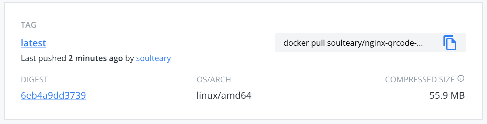

# High Performance Nginx Qrcode Server

High Performance QR Code Server with Nginx, Close to the size of the official Nginx Docker Image (~ 55MB).



## Quick Start

```bash
docker run --rm -it -p 8080:80 soulteary/nginx-qrcode-server
```

open browser, visit `localhost:8080`

## Resources

- Docker Pre-built: https://github.com/soulteary/ngx_http_qrcode_module
- QR-Encode Lib: https://github.com/fukuchi/libqrencode
- Docker Nginx Dev Env: https://github.com/nginx-with-docker/nginx-docker-playground
